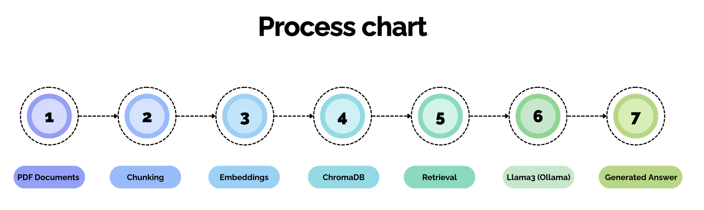
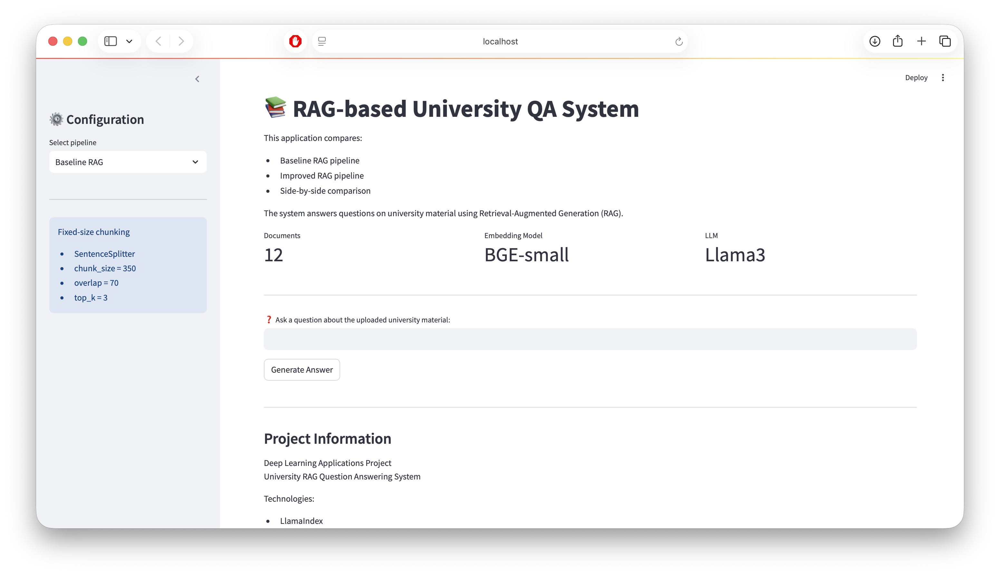
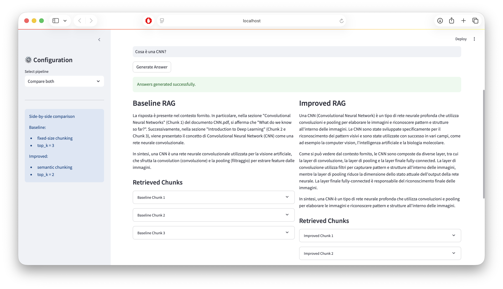
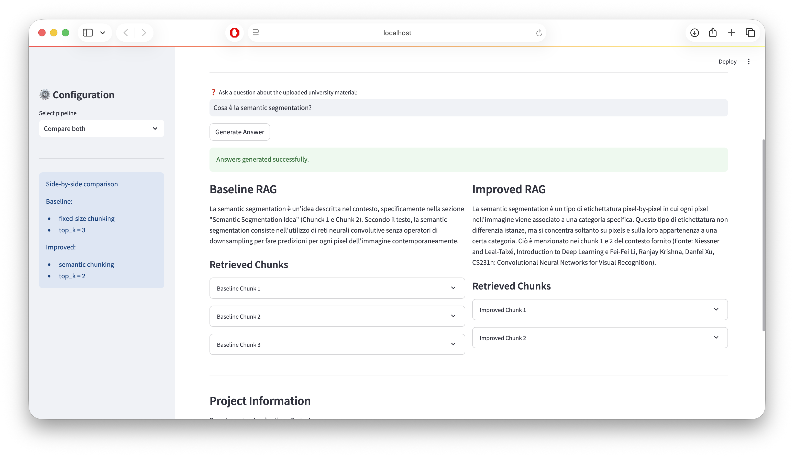
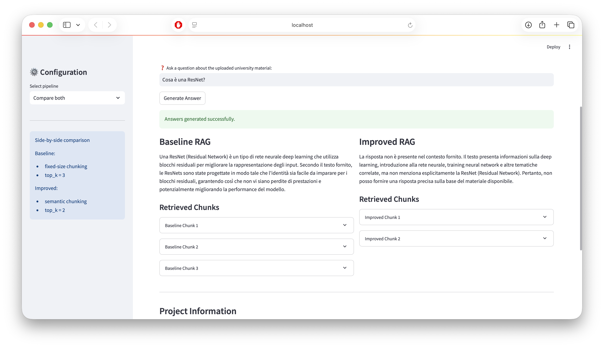

# RAG-based University Question Answering System

## Progetto per il corso di Deep Learning Applications

### Anna Setzu

---

# Abstract

In questo progetto viene sviluppato un sistema di Retrieval-Augmented Generation (RAG) per il Question Answering su materiale universitario relativo al Deep Learning e alle Convolutional Neural Networks (CNN).

Il sistema utilizza embeddings vettoriali, retrieval semantico e Large Language Models (LLM) eseguiti localmente per generare risposte contestualizzate a domande in linguaggio naturale.

Il progetto confronta due pipeline differenti:

- una pipeline baseline basata su fixed-size chunking;
- una pipeline migliorata basata su semantic chunking.

Le performance vengono valutate tramite un benchmark di domande costruito sui documenti caricati (attualmente, sono state caricate le slide della prima parte del corso Deep Learning Applications).

---

# 1. Introduzione

I Large Language Models (LLM) hanno mostrato ottime capacità nella generazione di testo e nel Question Answering. Tuttavia, questi modelli possono produrre informazioni errate o non presenti nelle fonti originali, fenomeno noto come hallucination.

Per ridurre questo problema è possibile utilizzare tecniche di Retrieval-Augmented Generation (RAG), che combinano retrieval semantico e generazione testuale.

In una pipeline RAG:

1. i documenti vengono suddivisi in chunk;
2. ogni chunk viene trasformato in un embedding vettoriale;
3. gli embeddings vengono salvati in un vector database;
4. il sistema recupera i chunk più rilevanti rispetto a una query;
5. il modello generativo utilizza il contesto recuperato per produrre la risposta.

L’obiettivo del progetto è sviluppare e confrontare due pipeline RAG per il Question Answering su materiale universitario.

---

# 2. Obiettivi del progetto

Gli obiettivi principali del progetto sono:

- implementare una pipeline RAG completa;
- utilizzare retrieval semantico tramite vector embeddings;
- confrontare una pipeline baseline e una pipeline migliorata;
- valutare sperimentalmente le performance delle due configurazioni;
- analizzare i vantaggi e i limiti del semantic chunking.

---

# 3. Dataset

Il dataset utilizzato è composto da slide universitarie in formato PDF riguardanti:

- Deep Learning;
- Optimization;
- Training Neural Networks;
- Regularization;
- CNN Architectures;
- AlexNet;
- VGG;
- GoogLeNet;
- ResNet;
- Semantic Segmentation;
- U-Net.

Le slide presentano caratteristiche particolarmente interessanti per un sistema RAG:

- testo sintetico;
- contenuto distribuito su più slide consecutive;
- dipendenza dal contesto semantico;
- presenza di diagrammi e immagini;
- spiegazioni frammentate.

Queste caratteristiche rendono il retrieval più complesso rispetto a documenti puramente discorsivi.

---

# 4. Architettura del sistema

La pipeline RAG implementata è composta dalle seguenti fasi:

1. document ingestion;
2. chunking;
3. embedding generation;
4. vector storage;
5. retrieval;
6. answer generation.

---

## 4.1 Architettura generale

Architettura del sistema

Figura 1 — Architettura generale della pipeline RAG.

---

## 4.2 Tecnologie utilizzate

Il progetto utilizza:

- Python
- LlamaIndex
- ChromaDB
- Ollama
- HuggingFace Embeddings
- Streamlit

Il Large Language Model utilizzato è:

- Llama3

Il modello embedding utilizzato è:

- BAAI/bge-small-en-v1.5

L’intera pipeline viene eseguita localmente, senza utilizzo di API proprietarie.

---

# 5. Pipeline Baseline

La pipeline baseline utilizza una strategia di chunking classica basata su chunk di dimensione fissa.

Configurazione:

- chunk_size = 350
- chunk_overlap = 70
- top_k = 3

Per il chunking viene utilizzato:

- SentenceSplitter

---

## 5.1 Motivazioni

Il fixed-size chunking rappresenta la configurazione più semplice e comune nei sistemi RAG.

L’overlap tra chunk consecutivi viene utilizzato per preservare parte del contesto locale.

---

## 5.2 Limiti della pipeline baseline

Questo approccio presenta alcuni limiti:

- possibile separazione di concetti semanticamente collegati;
- frammentazione di spiegazioni distribuite su più slide;
- perdita di continuità contestuale;
- retrieval meno coerente.

---

# 6. Pipeline Migliorata

La pipeline migliorata introduce semantic chunking tramite:

- SemanticSplitterNodeParser

In questo approccio il sistema utilizza embeddings per identificare punti di separazione semanticamente coerenti.

Configurazione:

- semantic chunking;
- top_k = 2.

---

## 6.1 Motivazioni

L’obiettivo del semantic chunking è preservare meglio:

- continuità semantica;
- relazioni tra slide consecutive;
- contesto informativo.

Questo è particolarmente importante per documenti sintetici come slide universitarie.

---

## 6.2 Vantaggi attesi

I vantaggi principali attesi sono:

- retrieval più coerente;
- chunk semanticamente più significativi;
- riduzione della frammentazione;
- migliore qualità delle risposte.

---

# 7. Interfaccia Streamlit

Per il progetto è stata sviluppata una demo interattiva tramite Streamlit.

L’interfaccia consente di:

- selezionare la pipeline;
- confrontare baseline e improved RAG;
- inserire domande in linguaggio naturale;
- visualizzare le risposte generate;
- osservare i chunk recuperati;
- analizzare i similarity scores.

---

## 7.1 Demo dell’applicazione

Demo Streamlit

Figura 2 — Home della demo Streamlit.

---

## 7.2 Confronto tra pipeline

Confronto pipeline

Figura 3 — Confronto side-by-side tra baseline e improved RAG.

---

# 8. Valutazione sperimentale

Per valutare le performance del sistema è stato costruito un benchmark di domande sui documenti caricati.

Per ogni domanda vengono definite:

- keywords attese;
- risposta attesa.

La metrica utilizzata è una semplice keyword-based evaluation.

Lo score finale rappresenta la frazione di keywords attese presenti nella risposta generata.

---

## 8.1 Ambiente di esecuzione

Il progetto è stato eseguito localmente su Apple Silicon tramite Ollama.

L’intera pipeline è stata eseguita offline senza utilizzo di API cloud proprietarie.

---

# 9. Risultati

## 9.1 Score medio

| Pipeline | Chunking Strategy | Score medio |
|---|---|---|
| Baseline RAG | Fixed-size chunking | 0.583 |
| Improved RAG | Semantic chunking | 0.506 |

In questa valutazione la pipeline baseline ha ottenuto uno score medio superiore rispetto alla pipeline improved.

---

## 9.2 Analisi qualitativa

I risultati mostrano che il semantic chunking non produce necessariamente un miglioramento generale delle performance.

Sebbene in alcune query il retrieval risulti più coerente dal punto di vista semantico, la pipeline baseline ha ottenuto uno score medio superiore nel benchmark utilizzato.

Questo suggerisce che, nel caso di slide universitarie sintetiche e fortemente frammentate, chunk di dimensione fissa possono risultare più efficaci per recuperare informazioni molto specifiche.

---

## 9.3 Caso di miglioramento

Esempio di query in cui la pipeline migliorata produce retrieval più coerente.

Caso miglioramento

Figura 4 — Esempio di miglioramento della pipeline semantic chunking.

In questo esempio la pipeline migliorata recupera chunk semanticamente più coerenti rispetto alla baseline.

Il semantic chunking preserva meglio il contesto relativo alla semantic segmentation, permettendo al modello di generare una risposta più precisa e completa.

---

## 9.4 Failure case

Il semantic chunking non migliora necessariamente ogni query.

In alcuni casi, la pipeline baseline produce retrieval migliori per domande molto specifiche e brevi.

Ad esempio, nella query relativa alle ResNet, il retrieval baseline ha recuperato chunk più direttamente collegati al concetto richiesto.

Failure case

Figura 5 — Failure case della pipeline semantic chunking.

In questo caso la pipeline baseline produce retrieval più specifici rispetto alla pipeline migliorata.

Il semantic chunking genera chunk più ampi e generici, riducendo la precisione del retrieval per query molto brevi e altamente specifiche.

---

# 10. Discussione

I risultati ottenuti mostrano che il semantic chunking non garantisce necessariamente un miglioramento delle performance rispetto a strategie di chunking tradizionali.

Tuttavia, il miglioramento non è uniforme per tutte le query.

Questo comportamento evidenzia un importante tradeoff tra:

- coerenza semantica;
- granularità del retrieval.

Nel dataset utilizzato, composto principalmente da slide sintetiche, il semantic chunking può produrre chunk più generici e meno specifici per query molto brevi.

Il progetto mostra quindi come le performance di una pipeline RAG dipendano fortemente:

- dalla struttura dei documenti;
- dalla strategia di chunking;
- dalla granularità del retrieval.

---

## 10.1 Limitazioni

Il progetto presenta alcune limitazioni.

La valutazione è stata effettuata tramite una semplice keyword-based evaluation, che non misura completamente la qualità semantica delle risposte generate.

Inoltre, il dataset utilizzato è relativamente piccolo ed è composto principalmente da slide sintetiche, caratterizzate da poco testo e forte dipendenza dal contesto visivo.

Infine, il sistema utilizza esclusivamente retrieval testuale e non considera immagini o diagrammi presenti nei documenti PDF.

---

# 11. Conclusioni

I risultati sperimentali mostrano che la pipeline baseline ottiene uno score medio superiore rispetto alla pipeline improved sul benchmark considerato.

Questo evidenzia come la scelta della strategia di chunking dipenda fortemente dalla natura dei documenti analizzati e dal tipo di informazioni che si desidera recuperare.

Il progetto conferma quindi l'importanza della valutazione sperimentale nei sistemi RAG e mostra che tecniche più sofisticate, come il semantic chunking, non garantiscono automaticamente risultati migliori.

---

# 12. Sviluppi futuri

Possibili sviluppi futuri includono:

- hybrid retrieval;
- reranking dei chunk;
- embeddings più avanzati;
- supporto multimodale;
- retrieval su immagini;
- metriche di valutazione più sofisticate;
- conversational memory;
- dataset più estesi e discorsivi.

---

# 13. Repository e codice sorgente

Il progetto è stato sviluppato interamente in Python utilizzando componenti open-source.

Struttura principale del progetto:
```
project-DLA-RAG/
│
├── data/
├── evaluation/
├── images/
├── src/
│
├── app.py
├── main_base.py
├── main_improved.py
├── run_evaluation.py
│
├── requirements.txt
├── README.md
└── report.md
```
Repository GitHub:
```
https://github.com/annasetzu/project-DLA-RAG.git
```

---

# 14. Tecnologie utilizzate

- Python
- LlamaIndex
- ChromaDB
- Ollama
- HuggingFace Embeddings
- Streamlit
- Pandas
- NumPy
- Scikit-learn